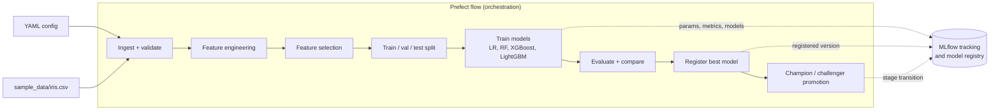

# Automated ML Pipeline

Give this service a YAML config that names a dataset, the column to predict, and
a few settings. It then runs the whole path from raw data to a registered model
on its own: it loads and checks the data, builds and selects features, trains
several models with hyperparameter search, compares them, registers the best one
in MLflow, and decides whether that model should replace the current production
model. You trigger a run over an HTTP API or a CLI, and watch the results in the
MLflow tracking UI.

It runs with no API keys and ships with a small sample dataset, so a full run
produces real trained models and real metrics out of the box.

## What an automated ML pipeline is, in plain language

Training a model by hand is a sequence of fiddly steps: pull the data, clean it,
turn raw columns into features, try a few model types, tune them, measure which
is best, and put the winner somewhere it can serve predictions. Doing that by
hand every time is slow and easy to get wrong.

An automated ML pipeline turns that sequence into a repeatable assembly line. You
describe the job once in a config file, and the pipeline runs the same stages in
the same order every time, records what happened, and produces a model you can
deploy. Re-running it on new data is one call, not a day of manual work.

## Prefect orchestrates, MLflow tracks

These two tools do different jobs, and it helps to keep them straight:

- **Prefect orchestrates.** The pipeline is defined as a Prefect *flow* made of
  *tasks*: ingest, validate, engineer features, select features, split, train,
  evaluate, register, promote. Prefect runs those tasks in order, retries the
  ones that are allowed to retry, and records each run. The bundled Prefect
  server provides a UI and scheduling. Prefect is about *running the steps*.

- **MLflow tracks.** As models are trained and registered, MLflow stores each
  run's parameters, metrics, and the trained model itself as artifacts, and it
  hosts the model registry where each model version is given a stage. MLflow is
  about *recording results and managing model versions*.

## How champion/challenger promotion works

The model currently serving in production is the champion. Each new pipeline run
produces a candidate, the challenger.

- On the first run there is no champion, so the newly registered version is
  promoted straight to the Production stage and becomes the champion.
- On later runs, the challenger is scored against the current champion on the
  held-out test set. It is promoted to Production only if it beats the champion
  by at least the configured `min_improvement` (F1 for classification, MSE for
  regression). If it does not clear that bar, it is parked in the Staging stage
  as a challenger and the champion keeps serving.

This means a run never blindly replaces a working model; promotion is gated on a
measured improvement.

## Architecture and pipeline stages



## Run it locally with Docker

From the repository root:

```bash
docker compose -f docker/docker-compose.yml up -d --build
```

This starts three services:

| Service | URL | Role |
|---------|-----|------|
| API (FastAPI) | http://localhost:8230 (docs at `/docs`) | trigger runs, predict, list models |
| MLflow | http://localhost:5230 | tracking UI and model registry (the screenshot surface) |
| Prefect | http://localhost:4230 | orchestration UI |

The ports (8230, 5230, 4230) are chosen so this stack does not collide with
sibling projects. The compose project is named `automated-ml-pipeline`.

Trigger a full pipeline run (it runs in the background):

```bash
curl -X POST http://localhost:8230/api/v1/pipeline/run \
  -H "Content-Type: application/json" \
  -d '{"config_path": "configs/classification_pipeline.yaml"}'
```

The run ingests the bundled iris dataset, trains logistic regression, random
forest, XGBoost, and LightGBM, compares them, registers the best as
`iris-classification` in MLflow, and promotes it. Run it a second time to see the
champion/challenger comparison on the next candidate.

Stop everything:

```bash
docker compose -f docker/docker-compose.yml down
```

You can also run a pipeline without the API, from inside the container or a local
install:

```bash
python scripts/run_pipeline.py configs/classification_pipeline.yaml
```

## What the screenshot shows

The screenshot surface is the **MLflow tracking UI at http://localhost:5230**.
After a run it shows:

- an experiment with the pipeline run, its logged metrics (accuracy, F1), and the
  trained model stored as an artifact, and
- under "Models", the registered model `iris-classification` with a version in the
  Production stage (the champion). After a second run, a challenger version
  appears in Staging if it did not beat the champion.

The FastAPI docs at http://localhost:8230/docs and the Prefect UI at
http://localhost:4230 are also available.

## API reference

| Method | Endpoint | Description |
|--------|----------|-------------|
| POST | `/api/v1/pipeline/run` | Trigger a pipeline run in the background |
| GET | `/api/v1/pipeline/status/{run_id}` | Status of a run |
| GET | `/api/v1/pipeline/history` | Past runs |
| POST | `/api/v1/predict` | Predict with the production model |
| GET | `/api/v1/models` | List registered models and their versions/stages |
| GET | `/health` | Health check |

## Cloud deployment

The deployment unit is the container image built from `docker/Dockerfile`.
`.github/workflows/cd.yml` builds that image and pushes it to GitHub Container
Registry (`ghcr.io`) on version tags. The same image runs on any container host,
which gives a path on each major cloud:

- **AWS**: run the container on ECS or App Runner; back MLflow artifacts with S3
  (`S3_BUCKET` env var); host the registered model on SageMaker if you want a
  managed endpoint.
- **GCP**: run the container on Cloud Run; use Vertex AI for managed training or
  model serving.
- **Azure**: run the container on Container Apps; use Azure ML for managed model
  hosting.

The repository ships the portable artifacts for this (the Dockerfile, the compose
file, and the CI publish workflow). Cloud-specific manifests are not included; see
`docs/DEPLOYMENT.md` for the environment variables (`MLFLOW_TRACKING_URI`,
`PREFECT_API_URL`, `S3_BUCKET`) and Kubernetes notes.

## Configuration

Pipelines are described by YAML files in `configs/`:

```yaml
name: iris-classification
data_source: sample_data/iris.csv
target_column: target
training_config:
  task_type: classification
  models: [logistic_regression, random_forest, xgboost, lightgbm]
  n_trials: 10
  metric: f1
evaluation_config:
  primary_metric: f1
  min_improvement: 0.01   # promotion gate
```

## Tech stack

- Orchestration: Prefect
- Tracking and model registry: MLflow
- Models: scikit-learn, XGBoost, LightGBM, with RandomizedSearchCV tuning
- API: FastAPI and Uvicorn
- Config: YAML
- Tests: pytest

## Development

```bash
make dev    # install with dev dependencies
make test   # run the test suite
make lint   # run the linter
```

## License

MIT
